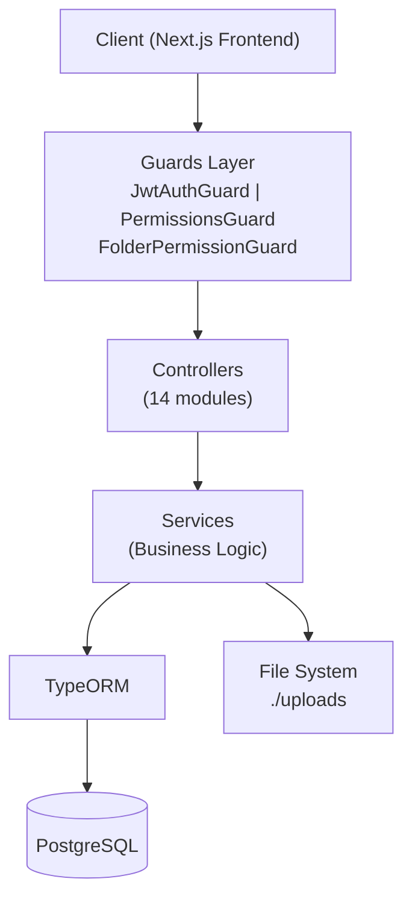
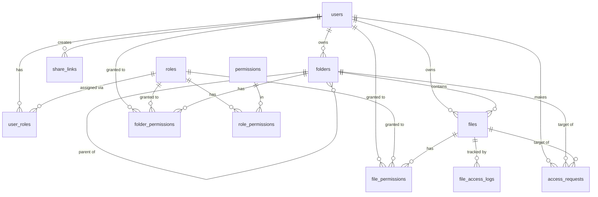
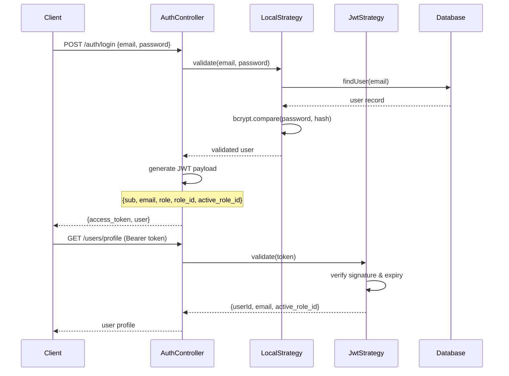

# Campus Repository System — Backend

Backend API untuk Campus Repository System FIK UPNVJ. Dibangun dengan NestJS 11 dengan arsitektur modular, PostgreSQL sebagai database utama, dan sistem RBAC (Role-Based Access Control) yang dapat dikonfigurasi secara dinamis.

---

## Project Overview

**Tujuan:** Menyediakan RESTful API yang aman dan scalable untuk sistem repository kampus, mencakup autentikasi JWT, manajemen file/folder hierarki, kontrol akses granular, dan fitur kolaborasi.

**URL Produksi:** `https://api.repository-upnvj.online`
**Port Default (Dev):** `3031`

---

## Architecture



NestJS menggunakan **pola modular**: setiap fitur terisolasi dalam module sendiri dengan controller, service, dan entity-nya. Guards diterapkan secara global via `APP_GUARD` di `AppModule`.

---

## Tech Stack

| Teknologi | Versi | Keterangan |
|-----------|-------|------------|
| **NestJS** | 11.0.1 | Progressive Node.js framework |
| **TypeScript** | 5.7.3 | Type-safe JavaScript |
| **Node.js** | 18+ | Runtime |
| **PostgreSQL** | 12+ | Database relasional |
| **TypeORM** | 0.3.28 | ORM untuk PostgreSQL |
| **Passport** | 0.7.0 | Middleware autentikasi |
| **passport-jwt** | - | JWT strategy |
| **passport-local** | - | Local (email/password) strategy |
| **@nestjs/jwt** | 11.0.2 | JWT module |
| **bcrypt** | 6.0.0 | Password hashing |
| **bcryptjs** | 3.0.3 | Password hashing (fallback) |
| **multer** | 2.0.2 | File upload handling |
| **class-validator** | 0.14.3 | DTO validation |
| **class-transformer** | 0.5.1 | Object transformation |
| **@nestjs/config** | 4.0.3 | Environment variables |
| **@nestjs/schedule** | 6.1.3 | Cron jobs |
| **Jest** | 30.0.0 | Testing framework |

---

## Modules

Aplikasi terdiri dari **14 module utama**:

| Module | Path | Fungsi |
|--------|------|--------|
| **AuthModule** | `src/auth/` | Login dengan LocalStrategy, generate JWT |
| **UsersModule** | `src/users/` | CRUD user, profile, switch role |
| **RolesModule** | `src/roles/` | List role, update max folder depth |
| **FoldersModule** | `src/folders/` | CRUD folder hierarki, tree view, permission checking |
| **FilesModule** | `src/files/` | Upload, download, preview (range request), rename, soft delete |
| **PermissionsModule** | `src/permissions/` | Manage folder-level permissions |
| **AccessRequestsModule** | `src/access-requests/` | Request akses, approve/reject, share file, hierarchy request |
| **SearchModule** | `src/search/` | Global search folder & file |
| **RecycleBinModule** | `src/recycle-bin/` | List, restore, dan permanent delete item terhapus |
| **ShareLinksModule** | `src/share-links/` | Generate & kelola public share link |
| **SettingsModule** | `src/settings/` | System settings (max upload size, dll) |
| **StatsModule** | `src/stats/` | Statistik dashboard untuk user & super admin |
| **CronModule** | `src/cron/` | Background scheduled tasks |
| **SuperAdminModule** | `src/super-admin/` | RBAC management: roles, permissions, user-roles, role-permissions |

**SuperAdminModule** terdiri dari 5 sub-module:
- `roles/` — CRUD role dinamis
- `permissions/` — CRUD permission dinamis
- `role-permissions/` — Assign permission ke role, copy antar role
- `user-roles/` — Assign/suspend/reaktivasi role ke user
- `shared/` — PermissionCacheService (cache permission untuk performa)

---

## Database Design

### Entity Diagram



### Deskripsi Tabel

#### `users`
| Kolom | Tipe | Deskripsi |
|-------|------|-----------|
| id | UUID (PK) | Primary key |
| email | varchar | Email unik (login credential) |
| password | varchar | bcrypt hash |
| name | varchar | Nama lengkap |
| role_id | UUID (FK) | Role utama (legacy, gunakan user_roles) |
| unit | varchar | Unit/departemen |
| max_folder_depth | int | Override kedalaman folder (null = ikut role) |
| created_at, updated_at | timestamp | Audit timestamps |

#### `roles`
| Kolom | Tipe | Deskripsi |
|-------|------|-----------|
| id | UUID (PK) | Primary key |
| name | varchar | Nama role |
| description | text | Deskripsi role |
| is_admin | boolean | Apakah role ini admin |
| is_active | boolean | Status aktif |
| is_system | boolean | Role bawaan sistem (tidak bisa dihapus) |
| is_private | boolean | Workspace terisolasi per user |
| hierarchy_level | int | Tingkat hierarki |
| category | varchar | Kategori role |
| color | varchar | Warna badge role |
| max_folder_depth | int | Batas kedalaman folder |
| deleted_at | timestamp | Soft delete |

#### `folders`
| Kolom | Tipe | Deskripsi |
|-------|------|-----------|
| id | UUID (PK) | Primary key |
| name | varchar | Nama folder |
| parent_id | UUID (FK, null) | Parent folder (null = root) |
| owner_id | UUID (FK) | Pemilik folder |
| role_id | UUID (FK) | Role workspace folder ini |
| unit | varchar | Unit asal folder |
| deleted_at | timestamp | Soft delete |

#### `files`
| Kolom | Tipe | Deskripsi |
|-------|------|-----------|
| id | UUID (PK) | Primary key |
| name | varchar | Nama file |
| path | varchar | Path fisik di `./uploads` |
| mime_type | varchar | MIME type file |
| size | bigint | Ukuran file dalam bytes |
| folder_id | UUID (FK) | Folder tempat file berada |
| owner_id | UUID (FK) | Pemilik file |
| uploaded_by_role_id | UUID (FK) | Role aktif saat upload |
| last_accessed_at | timestamp | Waktu terakhir diakses/preview |
| deleted_at | timestamp | Soft delete |

#### `permissions`
| Kolom | Tipe | Deskripsi |
|-------|------|-----------|
| id | UUID (PK) | Primary key |
| slug | varchar (unique) | Identifier unik, format: `module.action` |
| module | varchar | Modul (file, folder, user, role, system) |
| action | varchar | Aksi (upload, download, create, dll) |
| name | varchar | Nama tampilan |
| visibility | enum | `internal` / `public` / `hidden` |
| is_system | boolean | Permission bawaan sistem |
| deleted_at | timestamp | Soft delete |

#### `role_permissions`
| Kolom | Tipe | Deskripsi |
|-------|------|-----------|
| id | UUID (PK) | Primary key |
| role_id | UUID (FK) | Role yang punya permission |
| permission_id | UUID (FK) | Permission yang diberikan |
| granted_by | UUID | User yang memberikan |
| granted_at | timestamp | Waktu pemberian |

#### `folder_permissions`
| Kolom | Tipe | Deskripsi |
|-------|------|-----------|
| id | UUID (PK) | Primary key |
| folder_id | UUID (FK) | Target folder |
| user_id | UUID (FK, null) | Target user (null = berlaku untuk role) |
| role_id | UUID (FK, null) | Target role (null = berlaku untuk user spesifik) |
| can_read | boolean | Izin baca |
| can_create | boolean | Izin buat file/subfolder |
| can_update | boolean | Izin edit |
| can_delete | boolean | Izin hapus |
| can_download | boolean | Izin download |
| expires_at | timestamp | Expiration (null = tidak expire) |

#### `file_permissions`
| Kolom | Tipe | Deskripsi |
|-------|------|-----------|
| id | UUID (PK) | Primary key |
| file_id | UUID (FK) | Target file |
| user_id | UUID (FK, null) | Target user |
| role_id | UUID (FK, null) | Target role |
| can_read | boolean | Izin baca/preview |
| can_download | boolean | Izin download |
| expires_at | timestamp | Expiration |

#### `user_roles`
| Kolom | Tipe | Deskripsi |
|-------|------|-----------|
| id | UUID (PK) | Primary key |
| user_id | UUID (FK) | User |
| role_id | UUID (FK) | Role yang diberikan |
| is_primary | boolean | Apakah ini role utama |
| status | enum | `ACTIVE` / `SUSPENDED` / `PENDING_REACTIVATION` |
| suspended_reason | varchar | Alasan suspend |
| expires_at | timestamp | Expiration assignment |
| assigned_by | UUID | Admin yang mengassign |
| deleted_at | timestamp | Soft delete |

#### `access_requests`
| Kolom | Tipe | Deskripsi |
|-------|------|-----------|
| id | int (PK) | Primary key |
| requester_id | UUID (FK) | User yang meminta |
| folder_id | UUID (FK, null) | Target folder (null jika file) |
| file_id | UUID (FK, null) | Target file (null jika folder) |
| owner_id | UUID (FK) | Pemilik yang harus approve |
| status | enum | `pending` / `approved` / `rejected` |
| request_type | enum | `access` / `hierarchy` / `delete_confirmation` / `system_notification` |
| can_read/create/update/delete/download | boolean | Permission yang diminta |
| response_message | varchar | Pesan dari approver |

#### `file_access_logs`
| Kolom | Tipe | Deskripsi |
|-------|------|-----------|
| id | UUID (PK) | Primary key |
| file_id | UUID (FK) | File yang diakses |
| user_id | UUID (FK) | User yang mengakses |
| role_id | UUID (FK) | Role aktif saat akses |
| last_accessed_at | timestamp | Waktu terakhir akses |

Unique constraint: `(file_id, user_id, role_id)` — satu record per kombinasi.

#### `share_links`
| Kolom | Tipe | Deskripsi |
|-------|------|-----------|
| id | UUID (PK) | Primary key |
| token | varchar (unique) | Token publik unik |
| item_type | enum | `file` / `folder` |
| item_id | UUID | ID file atau folder |
| created_by | UUID (FK) | User pembuat |
| access_level | enum | `anyone` / `organization` |
| permission | enum | `view` / `download` |
| expires_at | timestamp | Expiration link |
| is_active | boolean | Status aktif |
| view_count | int | Jumlah view |
| download_count | int | Jumlah download |

#### `system_settings`
| Kolom | Tipe | Deskripsi |
|-------|------|-----------|
| key | varchar (PK) | Setting key |
| value | varchar | Setting value |
| updated_at | timestamp | Waktu update terakhir |

Contoh keys: `max_upload_size`, `max_storage_per_user`, `max_folder_depth`.

---

## Authentication Flow



### JWT Payload Structure

```typescript
{
  sub: string,           // user.id
  email: string,         // user.email
  role: string,          // role name (primary role)
  role_id: string,       // primary role ID
  active_role_id: string // role yang sedang aktif (bisa berubah via switch-role)
}
```

---

## Guards & Decorators

### Guards (diterapkan via APP_GUARD di AppModule)

| Guard | Fungsi |
|-------|--------|
| `JwtAuthGuard` | Validasi JWT token, skip endpoint dengan `@Public()` |
| `RolesGuard` | Cek role user sesuai `@Roles()` decorator |
| `PermissionsGuard` | Cek action-level permission via PermissionCacheService |
| `FolderPermissionGuard` | Cek folder-specific permission (read/create/update/delete) |

### Decorators

| Decorator | Fungsi |
|-----------|--------|
| `@Public()` | Bypass JWT guard (endpoint publik) |
| `@Roles('admin', 'wd1')` | Require salah satu role |
| `@RequirePermissions('file.upload')` | AND logic: semua permission harus ada |
| `@RequireAnyPermission('file.view', 'file.download')` | OR logic: salah satu permission cukup |
| `@RequirePermission(PermissionType.READ)` | Require folder permission spesifik |

---

## Environment Variables

Buat file `.env` di root `Repository-be/`:

```env
# Server
PORT=3031
NODE_ENV=development
CORS_ORIGIN=http://localhost:3000

# Database PostgreSQL
DB_HOST=localhost
DB_PORT=5432
DB_USERNAME=postgres
DB_PASSWORD=your_database_password
DB_NAME=repository

# JWT Authentication
JWT_SECRET=your-super-secret-jwt-key-change-in-production-min-32-chars
JWT_EXPIRES_IN=24h
```

| Variable | Wajib | Deskripsi |
|----------|-------|-----------|
| `PORT` | Tidak | Port server (default: 3031) |
| `NODE_ENV` | Tidak | `development` atau `production` |
| `CORS_ORIGIN` | Ya | URL frontend yang diizinkan |
| `DB_HOST` | Ya | Host PostgreSQL |
| `DB_PORT` | Tidak | Port PostgreSQL (default: 5432) |
| `DB_USERNAME` | Ya | Username PostgreSQL |
| `DB_PASSWORD` | Ya | Password PostgreSQL |
| `DB_NAME` | Ya | Nama database |
| `JWT_SECRET` | Ya | Secret key JWT — **wajib diganti di production**, minimal 32 karakter |
| `JWT_EXPIRES_IN` | Tidak | Masa berlaku token (default: `24h`) |

---

## Installation

```bash
cd Repository-be
npm install
```

---

## Database Setup

Urutan berikut adalah **satu-satunya langkah yang perlu dijalankan** untuk menyiapkan database dari nol — cukup dilakukan sekali saat deploy pertama kali.

### 1. Buat Database PostgreSQL

```bash
psql -U postgres
CREATE DATABASE campus_repository;
\q
```

### 2. Jalankan Schema + RBAC Seed

`create-database.sql` bersifat **all-in-one**: membuat seluruh tabel, seed 9 role default, seed 17 permission sistem, dan otomatis meng-grant semua permission ke role admin. Tidak perlu menjalankan script lain secara terpisah — file ini idempotent (aman dijalankan ulang kapan saja tanpa membuat data duplikat).

```bash
psql -U postgres -d campus_repository -f create-database.sql
```

### 3. Buat Akun Super Admin Pertama

Akun user (termasuk password ter-hash bcrypt) tidak dibuat lewat SQL, melainkan lewat script Node agar password diproses aman oleh aplikasi:

```bash
npm run seed:superadmin
```

Default: `superadmin@repository.com` / `SuperAdmin123!` — bisa dikustom lewat environment variable `ADMIN_EMAIL`, `ADMIN_PASSWORD`, `ADMIN_NAME`, `ADMIN_UNIT` sebelum menjalankan perintah di atas.

### 4. Buat Folder Uploads

```bash
mkdir uploads
# Linux/Mac:
chmod 755 uploads
```

> **Catatan:** `scripts/rbac-phase1.sql` dan `scripts/rbac-phase1-seed.sql` sudah digabung ke dalam `create-database.sql` di atas — kedua file tersebut tidak perlu dijalankan lagi.

---

## Running Development

```bash
npm run start:dev
```

Server berjalan di `http://localhost:3031/api` dengan hot-reload aktif.

---

## Build Production

```bash
npm run build
npm run start:prod
```

---

## Scripts

```bash
npm run start:dev      # Development dengan hot-reload
npm run start:debug    # Development dengan debug mode
npm run start:prod     # Production (jalankan dist/main.js)
npm run build          # Build TypeScript ke dist/
npm run lint           # ESLint + auto-fix
npm run format         # Prettier formatting
npm run test           # Unit tests (Jest)
npm run test:watch     # Test dengan watch mode
npm run test:cov       # Test dengan coverage report
npm run test:e2e       # End-to-end tests
```

---

## Deployment Guide

### Railway (Direkomendasikan untuk Quick Deploy)

1. Push `Repository-be` ke GitHub repository
2. Buat project baru di [railway.app](https://railway.app)
3. Add PostgreSQL service dari Railway
4. Deploy dari GitHub repository
5. Set environment variables di Railway dashboard
6. Set start command: `node dist/main.js`
7. Set build command: `npm install && npm run build`

### VPS (Ubuntu/Debian)

```bash
# Install Node.js 18+
curl -fsSL https://deb.nodesource.com/setup_18.x | sudo -E bash -
sudo apt install nodejs

npm install -g pm2
cd Repository-be
npm install
npm run build

cp .env.example .env
# Edit .env sesuai production

mkdir -p uploads && chmod 755 uploads
pm2 start dist/main.js --name "repository-be"
pm2 save && pm2 startup
```

**Konfigurasi Nginx:**

```nginx
server {
    listen 443 ssl;
    server_name api.repository-upnvj.online;

    client_max_body_size 500M;

    location / {
        proxy_pass http://localhost:3031;
        proxy_http_version 1.1;
        proxy_set_header Host $host;
        proxy_set_header X-Real-IP $remote_addr;
        proxy_set_header X-Forwarded-For $proxy_add_x_forwarded_for;
        proxy_set_header X-Forwarded-Proto $scheme;
        proxy_read_timeout 300s;
    }
}
```

### Docker (Opsional)

```dockerfile
FROM node:18-alpine
WORKDIR /app
COPY package*.json ./
RUN npm ci --only=production
COPY . .
RUN npm run build
RUN mkdir -p uploads
EXPOSE 3031
CMD ["node", "dist/main.js"]
```

```bash
docker build -t repository-be .
docker run -d -p 3031:3031 --env-file .env \
  -v $(pwd)/uploads:/app/uploads \
  --name repository-be repository-be
```

---

## API Documentation Summary

Semua endpoint menggunakan prefix `/api`. Semua endpoint (kecuali yang ditandai `[PUBLIC]`) memerlukan header:
```
Authorization: Bearer <jwt_token>
```

### Auth (`/api/auth`)
| Method | Endpoint | Keterangan |
|--------|----------|------------|
| POST | `/auth/login` [PUBLIC] | Login dengan email & password |
| POST | `/auth/register` [PUBLIC] | Register user baru |

### Users (`/api/users`)
| Method | Endpoint | Keterangan |
|--------|----------|------------|
| GET | `/users/profile` | Profil user saat ini |
| GET | `/users/role` | Role utama user |
| GET | `/users/my-roles` | Semua role assignments user |
| GET | `/users/my-permissions` | Effective permissions user |
| POST | `/users/switch-role` | Ganti role aktif |
| GET | `/users` | List semua user (admin) |
| POST | `/users` | Buat user baru (admin) |
| PATCH | `/users/:id` | Update user (admin) |
| DELETE | `/users/:id` | Hapus user (admin) |

### Folders (`/api/folders`)
| Method | Endpoint | Keterangan |
|--------|----------|------------|
| GET | `/folders/tree` | Folder tree user (permission-filtered) |
| GET | `/folders` | List folder yang accessible |
| GET | `/folders/shared/tree` | Shared folder tree |
| GET | `/folders/admin/all` | Semua folder (admin) |
| GET | `/folders/admin/tree` | Complete folder tree (admin) |
| GET | `/folders/:id` | Detail folder |
| POST | `/folders` | Buat folder |
| PATCH | `/folders/:id` | Update folder |
| DELETE | `/folders/:id` | Hapus folder (soft delete) |

### Files (`/api/files`)
| Method | Endpoint | Keterangan |
|--------|----------|------------|
| POST | `/files/upload/:folderId` | Upload file ke folder |
| GET | `/files/folder/:folderId` | List file dalam folder |
| GET | `/files/:id` | Detail file |
| GET | `/files/:id/preview` | Preview file (inline, support range request) |
| GET | `/files/:id/download` | Download file |
| PATCH | `/files/:id` | Rename file |
| DELETE | `/files/:id` | Hapus file (soft delete) |
| POST | `/files/:id/access` | Catat akses file |

### Permissions (`/api/permissions`)
| Method | Endpoint | Keterangan |
|--------|----------|------------|
| POST | `/permissions` | Buat permission folder |
| GET | `/permissions` | List permissions (filter by folderId) |
| GET | `/permissions/:id` | Detail permission |
| PATCH | `/permissions/:id` | Update permission |
| DELETE | `/permissions/:id` | Hapus permission |

### Access Requests (`/api/access-requests`)
| Method | Endpoint | Keterangan |
|--------|----------|------------|
| POST | `/access-requests` | Minta akses ke folder/file |
| GET | `/access-requests/my-requests` | Request yang dibuat user |
| GET | `/access-requests/shared-files` | File yang dishare ke user |
| POST | `/access-requests/files/:id/share` | Share file langsung |
| GET | `/access-requests/files/:id/shares` | List shares file |
| GET | `/access-requests/pending` | Pending requests (owner view) |
| GET | `/access-requests/notifications` | Notifikasi |
| PATCH | `/access-requests/:id/approve` | Approve request |
| PATCH | `/access-requests/:id/reject` | Reject request |
| POST | `/access-requests/hierarchy` | Request peningkatan kedalaman folder |
| PATCH | `/access-requests/:id/approve-hierarchy` | Approve hierarchy request (admin) |
| GET | `/access-requests/hierarchy/pending` | Pending hierarchy requests |

### Share Links (`/api/share`)
| Method | Endpoint | Keterangan |
|--------|----------|------------|
| POST | `/share/generate` | Generate public share link |
| GET | `/share/item/:type/:id` | Get existing share link untuk item |
| GET | `/share/:token` [PUBLIC] | Get share link metadata |
| GET | `/share/:token/contents` [PUBLIC] | Folder contents via share link |
| GET | `/share/:token/view` [PUBLIC] | Preview file via share link |
| GET | `/share/:token/download` [PUBLIC] | Download file via share link |
| GET | `/share/:token/file/:fileId/view` [PUBLIC] | Preview file dalam shared folder |
| GET | `/share/:token/file/:fileId/download` [PUBLIC] | Download file dalam shared folder |
| PUT | `/share/:token` | Update share link settings |
| POST | `/share/:token/regenerate` | Regenerate token |
| DELETE | `/share/:token` | Disable share link |
| GET | `/share/:token/stats` | Statistik share link |
| GET | `/share/my/links` | Share links milik user |

### Recycle Bin (`/api/recycle-bin`)
| Method | Endpoint | Keterangan |
|--------|----------|------------|
| GET | `/recycle-bin` | List item yang dihapus |
| PATCH | `/recycle-bin/restore/file/:id` | Restore file |
| PATCH | `/recycle-bin/restore/folder/:id` | Restore folder |
| DELETE | `/recycle-bin/file/:id` | Permanent delete file |
| DELETE | `/recycle-bin/folder/:id` | Permanent delete folder |

### Search (`/api/search`)
| Method | Endpoint | Keterangan |
|--------|----------|------------|
| GET | `/search?q=keyword` | Global search folder & file |

### Settings (`/api/settings`)
| Method | Endpoint | Keterangan |
|--------|----------|------------|
| GET | `/settings` | Get semua settings |
| PATCH | `/settings/:key` | Update setting |

### Super Admin — Roles (`/api/super-admin/roles`)
| Method | Endpoint | Keterangan |
|--------|----------|------------|
| POST | `/super-admin/roles` | Buat role |
| GET | `/super-admin/roles` | List semua role |
| GET | `/super-admin/roles/:id` | Detail role |
| PATCH | `/super-admin/roles/:id` | Update role |
| PATCH | `/super-admin/roles/:id/toggle-active` | Aktifkan/nonaktifkan role |
| DELETE | `/super-admin/roles/:id` | Hapus role |
| POST | `/super-admin/roles/:id/clone` | Clone role beserta permissions |

### Super Admin — Permissions (`/api/super-admin/permissions`)
| Method | Endpoint | Keterangan |
|--------|----------|------------|
| POST | `/super-admin/permissions` | Buat permission |
| GET | `/super-admin/permissions` | List permissions |
| GET | `/super-admin/permissions/:id` | Detail permission |
| PATCH | `/super-admin/permissions/:id` | Update permission |
| DELETE | `/super-admin/permissions/:id` | Hapus permission |

### Super Admin — Role Permissions (`/api/super-admin/role-permissions`)
| Method | Endpoint | Keterangan |
|--------|----------|------------|
| POST | `/super-admin/role-permissions` | Assign permissions ke role |
| GET | `/super-admin/role-permissions` | List permissions suatu role |
| POST | `/super-admin/role-permissions/copy` | Copy permissions dari role lain |

### Super Admin — User Roles (`/api/super-admin`)
| Method | Endpoint | Keterangan |
|--------|----------|------------|
| GET | `/super-admin/users/:userId/roles` | List role assignments user |
| POST | `/super-admin/users/:userId/roles` | Assign role ke user |
| POST | `/super-admin/user-roles/bulk-assign` | Bulk assign role |
| DELETE | `/super-admin/users/:userId/roles/:roleId` | Hapus role dari user |
| PATCH | `/super-admin/users/:userId/roles/:roleId/set-primary` | Set role utama |
| GET | `/super-admin/user-roles/pending-reactivation` | Pending reaktivasi |
| PATCH | `/super-admin/user-roles/:assignmentId/suspend` | Suspend role assignment |
| PATCH | `/super-admin/user-roles/:assignmentId/reactivate` | Reaktivasi role |
| PATCH | `/super-admin/user-roles/:assignmentId/request-reactivation` | Minta reaktivasi |

---

## File Upload

**Konfigurasi multer:**
- Storage: disk (`./uploads/`) dengan nama file UUID random
- Max size default: 500 MB (hard cap di multer)
- Max size configurable: via `system_settings.max_upload_size`

**Preview Support (Range Requests):**
- Endpoint `GET /files/:id/preview` mendukung HTTP Range header
- Return `206 Partial Content` untuk streaming video/audio

---

## Permission System

### Kategori Permission

| Prefix | Contoh Slug | Deskripsi |
|--------|-------------|-----------|
| `user.*` | `user.create`, `user.view` | Manajemen pengguna |
| `role.*` | `role.manage`, `role.view` | Manajemen role |
| `file.*` | `file.upload`, `file.download`, `file.delete` | Operasi file |
| `folder.*` | `folder.create`, `folder.create_subfolder` | Operasi folder |
| `system.*` | `system.settings`, `system.admin` | Administrasi sistem |

### Permission Cache

`PermissionCacheService` menyimpan cache `Map<userId_roleId, {slugs: Set, isWildcard: boolean}>` untuk menghindari query database berulang saat setiap request. Cache diinvalidasi saat role permissions, user role assignments, atau UserRole status berubah.

---

## Project Structure

```
src/
├── entities/                    # TypeORM entities (13 entities)
├── auth/                        # Modul autentikasi
├── users/                       # Modul user management
├── roles/                       # Modul roles
├── folders/                     # Modul folder management
├── files/                       # Modul file management
├── permissions/                 # Modul folder permissions
├── access-requests/             # Modul access request & sharing
├── search/                      # Modul global search
├── recycle-bin/                 # Modul recycle bin
├── share-links/                 # Modul public share links
├── settings/                    # Modul system settings
├── stats/                       # Modul statistics
├── cron/                        # Modul scheduled tasks
├── super-admin/                 # Modul RBAC management
│   ├── roles/
│   ├── permissions/
│   ├── role-permissions/
│   ├── user-roles/
│   └── shared/                  # PermissionCacheService
│
└── common/                      # Shared utilities
    ├── guards/                  # JwtAuthGuard, PermissionsGuard, dll
    ├── decorators/              # @Public, @Roles, @RequirePermissions
    ├── dto/                     # Shared DTOs
    ├── interfaces/              # TypeScript interfaces
    └── utils/                   # Utility functions
```
